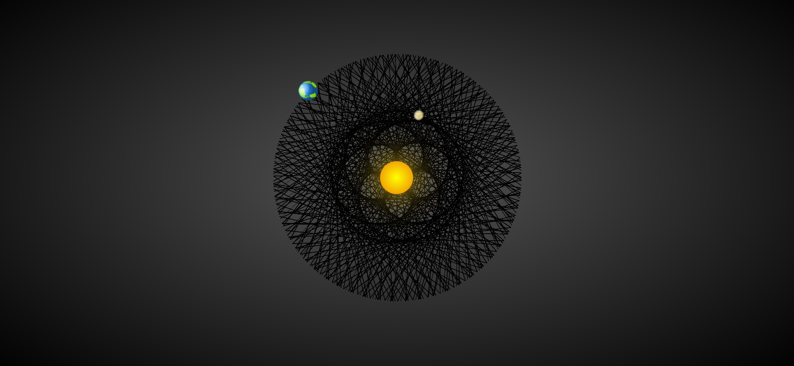
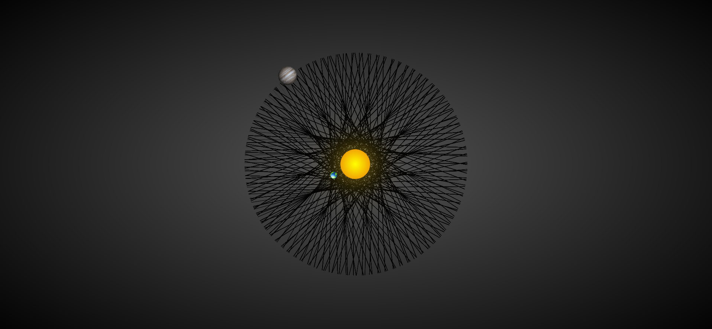

# PlanetDance

PlanetDance shows the incredibles and amazing patterns drawn by planets' revolution around the sun.

## Some Examples....

## Neptune and Uranus

## Earth and Venus

## Jupite and Earth

 
 

This project was bootstrapped with [Create React App](https://github.com/facebook/create-react-app).

## Available Scripts

In the project directory, you can run:

### `yarn start`

Runs the app in the development mode. 
Open [http://localhost:3000](http://localhost:3000) to view it in the browser.

## Learn More

You can learn more in the [Create React App documentation](https://facebook.github.io/create-react-app/docs/getting-started).

To learn React, check out the [React documentation](https://reactjs.org/).

